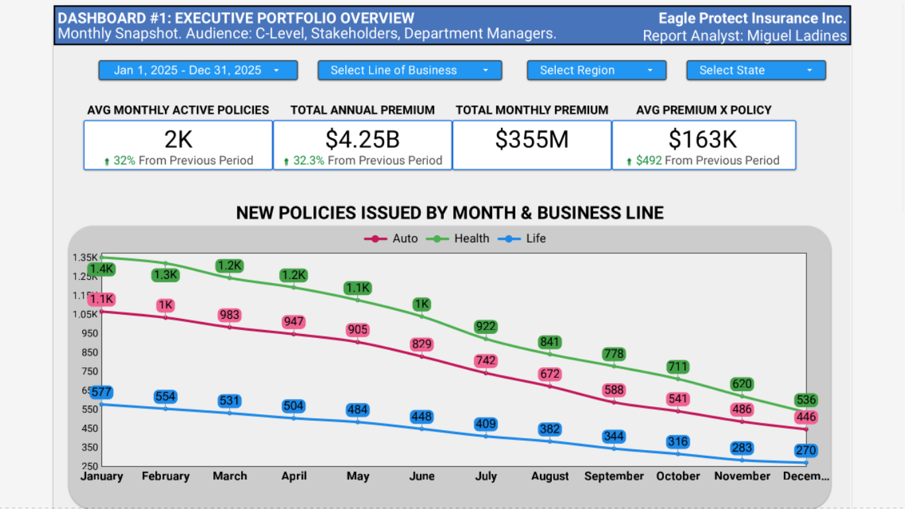

---

# Insurance Analytics End-to-End Data Pipeline

## Table of Contents

1. [Project Overview](#project-overview)
2. [Purpose & Scope](#purpose--scope)
3. [Business Context (Simulated Insurance Company)](#business-context-simulated-insurance-company)
4. [High-Level Architecture](#high-level-architecture)
5. [End-to-End Data Pipeline](#end-to-end-data-pipeline)
6. [Analytical & BI Layer](#analytical--bi-layer)
7. [Technology Stack & Design Rationale](#technology-stack--design-rationale)
8. [Repository Structure](#repository-structure)
9. [Documentation Index](#documentation-index)
10. [Data Disclaimer](#data-disclaimer)

---

## Project Overview

This project implements an **end-to-end insurance analytics data platform**, built as a **technical showcase** for the insurance domain.

The system simulates the full analytical lifecycle of an insurance portfolio — from synthetic data generation to interactive dashboards — with the goal of **demonstrating how modern data engineering and analytics capabilities can be applied in insurance environments**.

Rather than delivering a production-grade actuarial model, the project focuses on **showcasing architecture, data flows, validation logic, analytical schemas, and BI consumption patterns** that are commonly required in real insurance analytics initiatives.

---

## Purpose & Scope

The purpose of this project is to serve as a **demonstrative analytical platform** for insurance-focused use cases.

Specifically, it aims to:

* Illustrate how insurance-related data *could* be structured for modern analytics
* Provide a controlled environment to explore insurance KPIs and portfolio metrics
* Demonstrate how raw datasets can be transformed into analytics-ready models
* Enable interactive exploration of metrics through BI dashboards

The underlying data model and assumptions are **intentionally simplified**.
They are **not intended to represent a realistic or validated actuarial model**, but rather to act as a **technical showcase and discussion starting point**.

In a real-world engagement, a proper actuarial study, business discovery phase, and domain-specific modeling would be required.

---

## Business Context (Simulated Insurance Company)

The datasets simulate a fictional insurance carrier:

**Company:** *Eagle Insurance Inc.*
**Market:** United States
**Time Horizon:** 2024–2025
**Portfolio Size:** ~2,000 simulated clients
**Geographic Coverage:** 4 regions, 18 states

The simulated context supports exploratory analysis around:

* Portfolio composition
* Policy and premium distribution
* Claims activity
* Expenses and taxes
* Geographic and product segmentation

The business narrative exists to **anchor technical and analytical demonstrations**, not to model real insurance behavior.

---

## High-Level Architecture

The platform follows a layered analytical architecture designed to resemble common insurance data platforms:

```
Configuration Layer
   ↓
Synthetic Data Generation (RAW)
   ↓
Data Validation & Health Checks
   ↓
Normalization & Transformation
   ↓
Analytical Schema (PostgreSQL)
   ↓
Analytical Views
   ↓
Interactive BI Dashboards
```

Each layer introduces explicit validation to ensure data consistency and analytical usability downstream.

---

## End-to-End Data Pipeline

The pipeline is implemented as a sequence of modular Python scripts executed in a controlled order:

1. **Dataset Configuration**

   * Generates configuration parameters for the simulated portfolio
   * Defines scope, time window, geography, and volume assumptions

2. **Synthetic Dataset Generation**

   * Produces RAW CSV datasets:

     * Clients
     * Policies
     * Claims
     * Expenses
     * Taxes

3. **RAW Dataset Validation**

   * Validates file presence
   * Checks row counts and value ranges

4. **Normalization & Transformation**

   * Cleans and standardizes RAW data
   * Produces analytics-ready dimension and fact tables

5. **Database Readiness Validation**

   * Verifies database connectivity and permissions
   * Confirms readiness for schema deployment

6. **Normalized Data Validation**

   * Ensures structural and formatting consistency
   * Validates expected distributions and integrity

7. **Schema Deployment**

   * Executes a full SQL schema including:

     * Tables and facts
     * Indexes
     * Row-Level Security (RLS)
     * Grants
     * Analytical views

8. **Schema Validation**

   * Confirms successful schema creation

9. **Data Loading**

   * Loads normalized data into the warehouse
   * Enforces correct loading order

10. **Post-load Validation**

    * Confirms data completeness and consistency at database level

Execution details are documented in `docs/pipeline.md`.

---

## Analytical & BI Layer

### BI Platform

* **Google Looker Studio**

The BI layer is built on top of **dedicated SQL analytical views**, each designed to support a specific dashboard or analytical use case.

---

### Implemented Dashboard

#### Dashboard 1 — Executive Portfolio Overview

<p align="center">
  
</p>


An executive-style overview focused on high-level portfolio indicators, including:

* Portfolio size and evolution
* Premium exposure
* Policy distribution
* Geographic and product segmentation

🔗 **Public Interactive Dashboard:**
[https://lookerstudio.google.com/s/ruPQKlKs2CA](https://lookerstudio.google.com/s/ruPQKlKs2CA)

📄 **Static Snapshots:**

* `assets/executive_dashboard_annual_nofilters_2024.pdf`
* `assets/executive_dashboard_annual_nofilters_2025.pdf`

---

### Planned Analytical Dashboards (TBD)

* Claims & Loss Performance
* Operational Metrics
* Risk & Underwriting Insights

Each dashboard is backed by **one SQL view per dashboard**, maintaining clear analytical boundaries.

---

## Technology Stack & Design Rationale

### Data Warehouse

* **Supabase (PostgreSQL)**
  Chosen for:
* PostgreSQL compatibility
* Row-Level Security support
* Structured schema and permission management
* Cost-efficient experimentation

### Analytics & BI

* SQL-based analytical views
* Google Looker Studio for interactive reporting

### Data Engineering

* Python
* Pandas
* Modular pipeline architecture
* Explicit validation and health checks

The stack and design choices emphasize **clarity, reproducibility, and analytical accessibility**.

---

## Repository Structure

```text
.
├── docs
├── output
│   ├── config.json
│   ├── raw
│   └── normalized
├── schema
│   └── schema.sql
├── assets
│   └── executive_dashboard_annual_*.pdf
├── scripts
│   └── pipeline modules & healthchecks
└── utils
    └── database reset utilities
```

---

## Documentation Index

Supporting documentation is available in `/docs`:

* `architecture.md` — System architecture
* `pipeline.md` — Pipeline execution flow
* `schema_contract.md` — Warehouse schema contract
* `data_model_design.md` — Analytical data model
* `data_dictionary.md` — Column-level definitions
* `data_quality.md` — Validation rules
* `dashboards.md` — BI and dashboard design
* `business_assumptions.md` — Modeling assumptions
* `supabase.md` — Database setup
* `env_example.md` — Environment variables reference

---

## Data Disclaimer

All data used in this project is **fully synthetic**.

* It does not represent real customers, policies, claims, or financial records
* The model is simplified and illustrative
* The project is intended for **technical demonstration and exploratory analysis only**

---

### Closing note

This repository represents a **technical showcase of an insurance analytics platform**, designed to illustrate how data engineering and analytics practices can be applied in the insurance domain, while leaving room for future, domain-specific modeling and actuarial validation if required.

---
