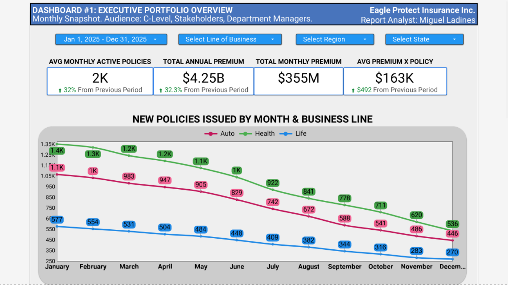
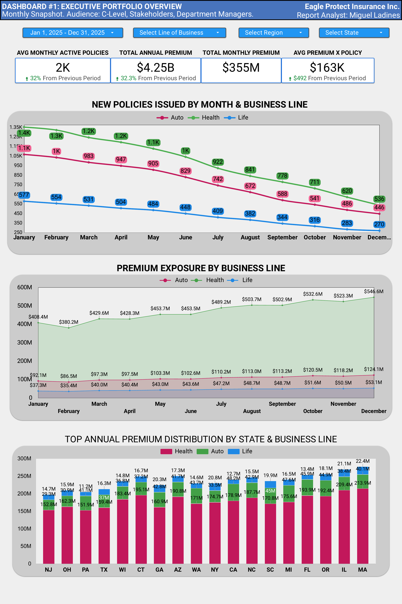
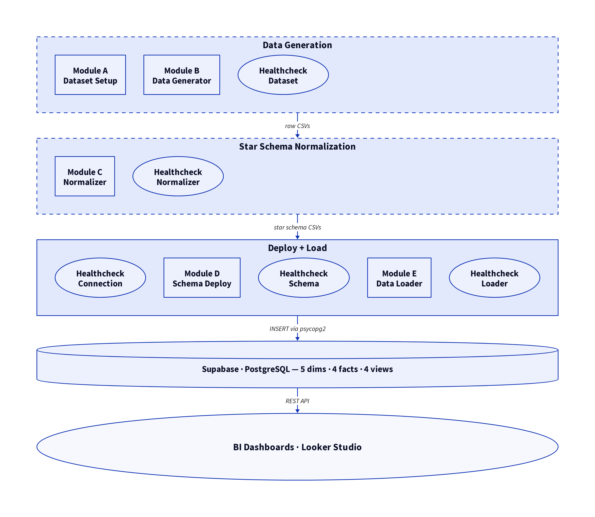
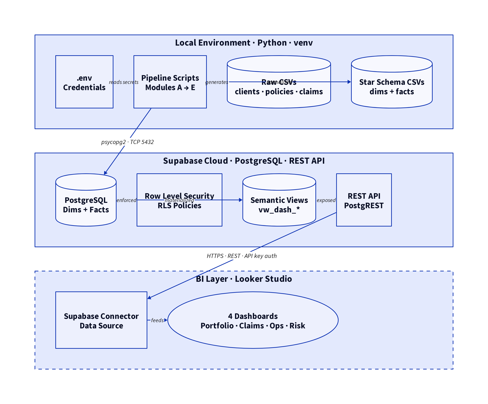
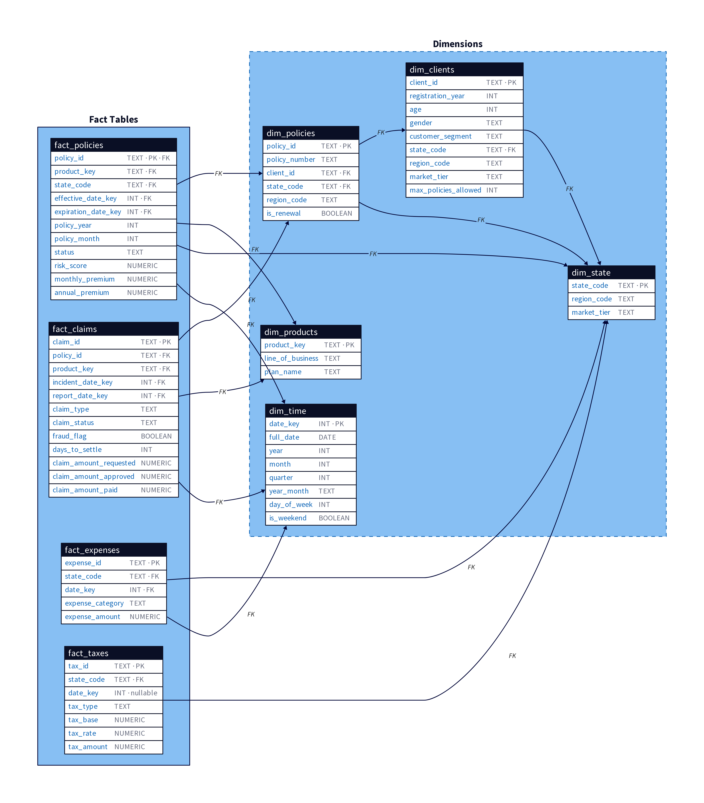
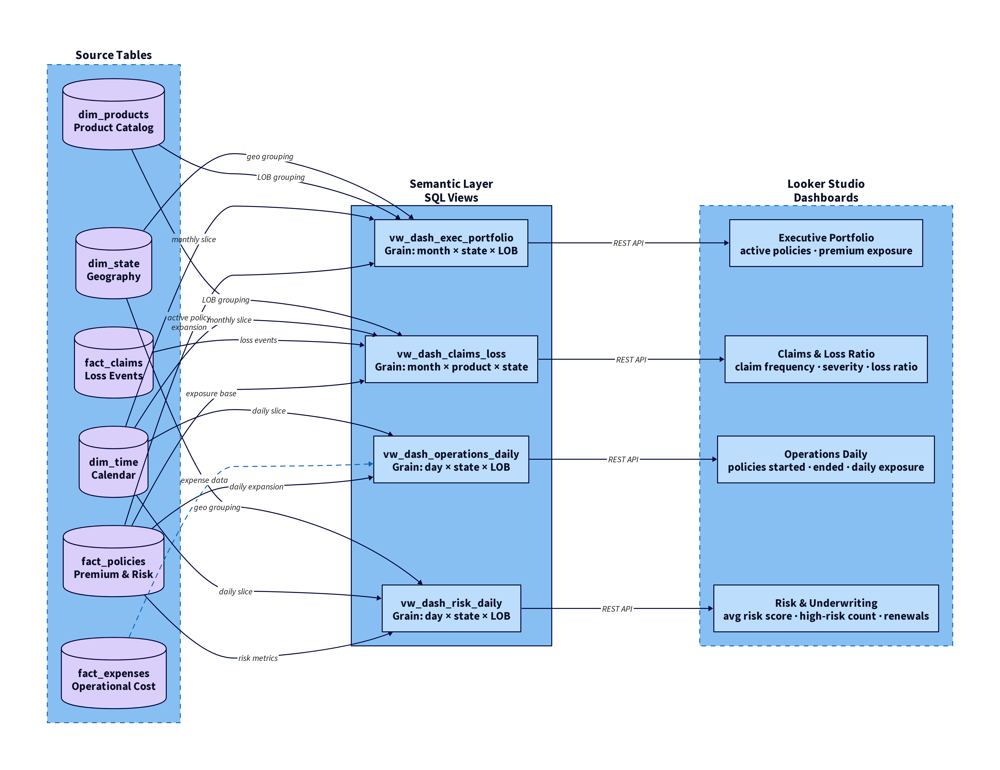

<h1 align="center">📊 Insurance Analytics — End-to-End Data Pipeline and BI Platform</h1>

<p align="center"><em>A modular Python pipeline that generates synthetic insurance portfolio data, validates every stage boundary, loads a star schema into PostgreSQL, and serves four executive dashboards through a semantic view layer.</em></p>

<p align="center">
  
  
  
  
  
  
  
</p>

---



## Table of Contents

1. [Overview](#1-overview)
   - [1.1 The problem](#11-the-problem)
   - [1.2 What it does](#12-what-it-does)
   - [1.3 Key features](#13-key-features)
2. [Walkthrough](#2-walkthrough)
   - [2.1 Executive Portfolio Overview — 2025 annual snapshot](#21-executive-portfolio-overview--2025-annual-snapshot)
   - [2.2 Additional dashboards](#22-additional-dashboards)
3. [Architecture](#3-architecture)
   - [3.1 Pipeline flow](#31-pipeline-flow)
   - [3.2 Components](#32-components)
   - [3.3 Key decisions](#33-key-decisions)
4. [Tech stack](#4-tech-stack)
5. [Getting started](#5-getting-started)
   - [5.1 Prerequisites](#51-prerequisites)
   - [5.2 Installation](#52-installation)
   - [5.3 Configuration](#53-configuration)
   - [5.4 Run the pipeline](#54-run-the-pipeline)
6. [Testing](#6-testing)
   - [6.1 Automated pipeline tests — health-check scripts](#61-automated-pipeline-tests--health-check-scripts)
   - [6.2 Manual dashboard testing — filter validation](#62-manual-dashboard-testing--filter-validation)
7. [Author](#7-author)

## 1. Overview

### 1.1 The problem

Insurance analytics teams need trustworthy, dashboard-ready data to monitor portfolio size, premium exposure, claims performance, and risk — but raw operational records are messy, ungoverned, and hard to connect directly to a BI tool. Building a reliable platform requires coordinating data generation, schema design, multi-stage validation, bulk loading, and a semantic layer, with each boundary introducing its own failure modes.

### 1.2 What it does

- Generates a configurable synthetic insurance portfolio — clients, policies, claims, expenses, and taxes — modeled on realistic US insurance patterns across 4 regions, 18 states, and 3 lines of business (Life, Health, Auto)
- Validates data quality at each pipeline boundary before the next module runs; any failure exits non-zero and blocks downstream stages
- Deploys a PostgreSQL star schema (5 dimension tables, 4 fact tables) with Row-Level Security to Supabase
- Bulk-loads normalized CSVs into the warehouse using `COPY` inside a single transaction
- Exposes four analytical views as a semantic layer — one per dashboard — with fixed grains and pre-computed KPIs
- Feeds Google Looker Studio dashboards for portfolio overview, claims performance, daily operations, and risk monitoring

### 1.3 Key features

- **Validation-first design** — five health-check scripts guard every stage boundary and exit non-zero on failure; data quality issues surface before they reach a dashboard
- **Star schema with time expansion** — policies contribute to every active month via `date_key BETWEEN effective AND expiration`, producing correct exposure metrics rather than point-in-time counts
- **Semantic layer contract** — one view = one dashboard; BI tools read pre-aggregated, fixed-grain metrics and never join raw tables directly
- **Configurable scale** — portfolio size is set interactively at run time (default: 3,000 historical clients; range: 500–100,000)
- **Fully synthetic** — no real customer data; all records generated from a configurable PRNG seed, reproducible across runs
- **Reproducible from scratch** — 10 ordered scripts take the platform from empty to working dashboards; steps 1–5 run locally, steps 6–10 require a PostgreSQL connection

## 2. Walkthrough

### 2.1 Executive Portfolio Overview — 2025 annual snapshot

Full dashboard view for January–December 2025. Three interactive filters — **Line of Business**, **Region**, and **State** — are wired to all charts; selecting any combination updates every KPI and chart simultaneously, which was verified manually during testing.



**KPIs (no filters, full year 2025):**

| Metric | Value | vs. 2024 |
|--------|-------|----------|
| Avg monthly active policies | 2 K | +32% |
| Total annual premium | $4.25 B | +32.3% |
| Total monthly premium | $355 M | — |
| Avg premium per policy | $163 K | +$492 |

**Charts visible:**

- *New Policies Issued by Month & Business Line* — line chart tracking monthly new-policy counts for Auto, Health, and Life across all 12 months
- *Premium Exposure by Business Line* — monthly stacked premium exposure, Auto/Health/Life series
- *Top Annual Premium Distribution by State & Business Line* — grouped bar chart ranked by state, showing LOB mix per state (18 states covered)

A full-page static snapshot in PDF format is also available in the repository: [`assets/executive_dashboard_annual_nofilters_2025.pdf`](./assets/executive_dashboard_annual_nofilters_2025.pdf) · [`assets/executive_dashboard_annual_nofilters_2024.pdf`](./assets/executive_dashboard_annual_nofilters_2024.pdf)

### 2.2 Additional dashboards

The platform includes three further dashboards backed by the same semantic layer:

- **Claims & Loss** — monthly claim frequency, severity, and loss ratio by LOB, product, and state
- **Operations Daily** — daily active policy count, new business starts, and expirations
- **Risk & Underwriting** — daily avg risk score, high-risk policy count, and new-business vs. renewal mix

## 3. Architecture

### 3.1 Pipeline flow

The platform is a layered, validation-first pipeline. Each module hands off to the next only after an explicit health check passes. Modules A–E do the work; scripts 03, 05, 06, 08, and 10 are the gatekeepers.



*Rectangles are the work modules (A–E); ovals are the health-check gates — each stage proceeds only once its gate passes.*

The same stages mapped onto their runtime environments — the local Python pipeline, the Supabase cloud warehouse, and the Looker Studio BI layer:



*Two links cross a trust boundary: `psycopg2` over TCP 5432 for the load, and PostgREST over HTTPS for every dashboard read.*

### 3.2 Components

| Script | Role | Outputs |
|--------|------|---------|
| `01_module_A_dataset_setup.py` | **Module A** — writes the pipeline configuration | `output/config.json` |
| `02_module_b_dataset_generator.py` | **Module B** — generates synthetic raw datasets | `output/raw/*.csv` |
| `03_healthcheck_dataset.py` | Validates raw data: file presence, row counts, value ranges | — |
| `04_module_C_normalizer.py` | **Module C** — transforms raw CSVs into star-schema layout | `output/normalized/*.csv` |
| `05_healthcheck_normalizer.py` | Validates star schema: column contracts, duplicate keys, FK integrity | — |
| `06_healthcheck_connection.py` | Verifies env vars and PostgreSQL connectivity | — |
| `07_module_D_schema.py` | **Module D** — deploys `schema.sql` to Supabase (tables, indexes, RLS, views) | PostgreSQL schema |
| `08_healthcheck_schema.py` | Verifies tables, BI views, and RLS access (`service_role` passes, `anon` blocked) | — |
| `09_module_E_loader.py` | **Module E** — bulk-loads normalized CSVs via `COPY` | PostgreSQL rows |
| `10_healthcheck_loader.py` | Post-load checks: row counts, FK resolution, all four BI views execute | — |

**Star schema — 5 dimensions, 4 facts:**

- **Dimensions:** `dim_time` (daily calendar), `dim_state` (geography + market tier), `dim_clients`, `dim_products` (LOB + plan), `dim_policies`
- **Facts:** `fact_policies` (premiums + risk scores), `fact_claims` (loss amounts + fraud flags), `fact_expenses` (monthly operating costs by state), `fact_taxes` (premium tax per policy)



*Every fact resolves its foreign keys to a dimension primary key; `dim_time` and `dim_state` are conformed across all four facts.*

**Semantic layer — 4 analytical views:**

| View | Dashboard | Grain |
|------|-----------|-------|
| `vw_dash_exec_portfolio` | Executive Portfolio | Month × state × region × LOB |
| `vw_dash_claims_loss` | Claims & Loss | Month × product × state × region |
| `vw_dash_operations_daily` | Operations Daily | Day × state × region × LOB |
| `vw_dash_risk_daily` | Risk & Underwriting | Day × state × region × LOB |



*One view per dashboard — each pre-joins its facts and dimensions at a single fixed grain, so BI tools read KPIs without re-aggregating.*

Full data model: [`docs/data_design_specs.md`](./docs/data_design_specs.md) · SQL contract: [`schema/schema.sql`](./schema/schema.sql)

### 3.3 Key decisions

| Decision | Chosen | Discarded | Reason |
|----------|--------|-----------|--------|
| Schema modeling | Star schema (dimensional) | Flat denormalized table | Optimized for BI aggregation; isolates business entities cleanly; no surrogate keys needed |
| Time expansion | Policy active on every date in `effective…expiration` range | Snapshot only at policy start date | Exposure metrics count active policies for every period they are in force, not just when they started |
| Semantic layer | One view per dashboard, fixed grain | Calculated fields defined in the BI tool | Enforces single source of KPI truth; prevents dashboards from redefining the same metric differently |
| Access control | RLS on all tables; `service_role` for ETL, read-only `authenticated` for BI | Open access or application-layer filtering | Security enforced at the database level, not in the pipeline or the BI tool |
| Validation pattern | Numbered health-check scripts, exit non-zero on failure | Separate unit-test framework | Validation runs in sequence as part of the pipeline; failures block downstream stages immediately |

## 4. Tech stack

| Layer | Technology | Why this over alternatives |
|-------|------------|---------------------------|
| Language | Python 3.14 | Latest stable; matches the development environment |
| Data generation & ETL | `pandas` 3.0.3, `NumPy` 2.5.0 | NumPy for vectorized synthesis and stochastic modelling; pandas for column-level transforms and CSV I/O |
| Database warehouse | PostgreSQL via Supabase | Full SQL star-schema support; RLS per table; Supabase adds managed hosting and a REST endpoint for health-check verification |
| Database driver | `psycopg2-binary` 2.9.12 | Standard PostgreSQL driver with `COPY` support for high-throughput bulk loads; `psycopg2-binary` avoids build-tool dependencies |
| REST validation | `requests` 2.31.0 | Lightweight; used only to verify the Supabase REST endpoint responds correctly with the anon key during health checks |
| BI dashboards | Google Looker Studio + PostgreSQL connector | Zero-infrastructure; the PostgreSQL connector links directly to the Supabase database and reads the semantic views; no separate BI server needed |

## 5. Getting started

### 5.1 Prerequisites

- Python 3.14
- `pip` and a virtual environment tool
- A Supabase project, or any PostgreSQL database reachable via a connection string — required for steps 6–10 only
- A Google Looker Studio account — optional, for the dashboard layer

### 5.2 Installation

```bash
git clone <this-repo-url>
cd insurance-analytics

python3 -m venv .venv
source .venv/bin/activate

pip install pandas numpy psycopg2-binary requests
```

> No `requirements.txt` is present — install the four libraries directly as shown above.

### 5.3 Configuration

Database scripts (steps 6–10) read credentials from environment variables. A template is provided at [`env.example`](./env.example).

| Variable | Description |
|----------|-------------|
| `SUPABASE_URL` | Base URL of your Supabase project: `https://<project-id>.supabase.co` |
| `SUPABASE_SERVICE_ROLE_KEY` | Service-role key — full access; used by ETL and validation scripts. Keep secret. |
| `SUPABASE_ANON_KEY` | Anonymous public key — used to confirm RLS blocks anonymous REST access. |
| `SUPABASE_DB_URL` | PostgreSQL connection string: `postgres://postgres:<password>@db.<project-id>.supabase.co:5432/postgres` |

```bash
cp env.example .env
# edit .env with real values

set -a && source .env && set +a   # export variables into the current shell
```

> Never commit `.env` — it is already in `.gitignore`.

### 5.4 Run the pipeline

**Steps 1–5 run entirely locally — no database required.**

```bash
python scripts/01_module_A_dataset_setup.py      # prompts for client count (default: 3,000)
python scripts/02_module_b_dataset_generator.py  # writes output/raw/*.csv
python scripts/03_healthcheck_dataset.py         # validates raw data

python scripts/04_module_C_normalizer.py         # writes output/normalized/*.csv
python scripts/05_healthcheck_normalizer.py      # validates star schema + referential integrity
```

**Steps 6–10 require the environment variables from §5.3.**

```bash
python scripts/06_healthcheck_connection.py      # verify connectivity

cd schema
python ../scripts/07_module_D_schema.py          # deploy schema, indexes, RLS, views
cd ..

python scripts/08_healthcheck_schema.py          # verify schema and RLS access
python scripts/09_module_E_loader.py             # bulk-load normalized CSVs
python scripts/10_healthcheck_loader.py          # post-load validation
```

> Script 07 resolves `schema.sql` relative to the working directory — run it from `schema/` as shown.

**Connect Looker Studio** — in Looker Studio, add a data source using the **PostgreSQL** connector. Connect to your Supabase database host (`db.<project-id>.supabase.co`, port 5432, database `postgres`) with the `authenticated` role credentials. Create one report per BI view (`vw_dash_exec_portfolio`, `vw_dash_claims_loss`, `vw_dash_operations_daily`, `vw_dash_risk_daily`).

**Reset the database** — `utils/erase.py` drops and recreates the entire `public` schema (destructive). Run it from the `utils/` directory: `cd utils && python erase.py`.

## 6. Testing

The pipeline has two testing layers: automated health-check scripts that gate each stage, and manual dashboard testing that validates the BI layer end to end.

### 6.1 Automated pipeline tests — health-check scripts

The five health-check scripts are the pipeline's test suite. Each exits non-zero on failure, blocking the next stage. They can be run standalone at any point.

| Script | What it asserts |
|--------|----------------|
| `03_healthcheck_dataset.py` | All 5 raw CSVs present; no duplicate PKs; age bounds (18–84); premium > 0; `effective_date ≤ expiration_date`; policy dates within 2024–2025 window; `client_id` FK resolves; claims-to-policies ratio in expected range (10–50%) |
| `05_healthcheck_normalizer.py` | All 9 normalized CSVs present; column contracts on every dimension and fact; no duplicate PKs; full FK chain (`fact_policies → dim_policies → dim_clients → dim_state`; `fact_claims → dim_policies, dim_products, dim_time`); no negative amounts |
| `06_healthcheck_connection.py` | All four environment variables set; PostgreSQL connection succeeds |
| `08_healthcheck_schema.py` | All 9 tables and 4 views exist in `public`; `service_role` receives HTTP 200 on all views via REST; `anon` role is blocked (HTTP 401/403) on all views |
| `10_healthcheck_loader.py` | All 9 tables non-empty; full FK integrity via LEFT JOIN (dim_policies, fact_policies, fact_claims, fact_expenses, fact_taxes); all 4 BI views execute and return rows |

```bash
python scripts/05_healthcheck_normalizer.py   # run any check standalone
```

### 6.2 Manual dashboard testing — filter validation

After loading, the four Looker Studio dashboards were tested manually by varying the three cross-dashboard filters and confirming that every KPI and chart updated correctly:

| Filter | Values tested | Expected behaviour |
|--------|---------------|--------------------|
| Line of Business | All / Life / Health / Auto | KPIs and all charts scope to the selected LOB only |
| Region | All / NE / SE / MW / W | State bars and time-series narrow to the selected region |
| State | All / individual states | All metrics drill down to single-state figures |

Combining filters (e.g. Health + Northeast + NY) produces consistent, non-zero results, confirming that the time-expansion join in `vw_dash_exec_portfolio` and the claims join in `vw_dash_claims_loss` work correctly at every slice granularity.

## 7. Author

**Miguel Ladines** · [@dev-mikel](https://github.com/dev-mikel)  
Electronics Engineer · AI Developer | Automation & Systems Integration


